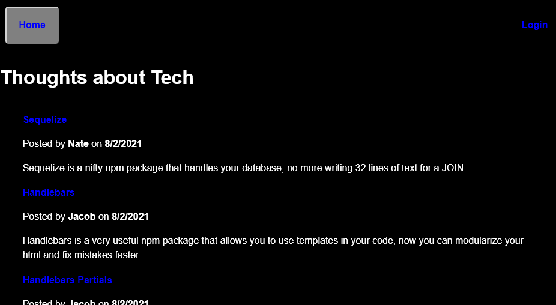
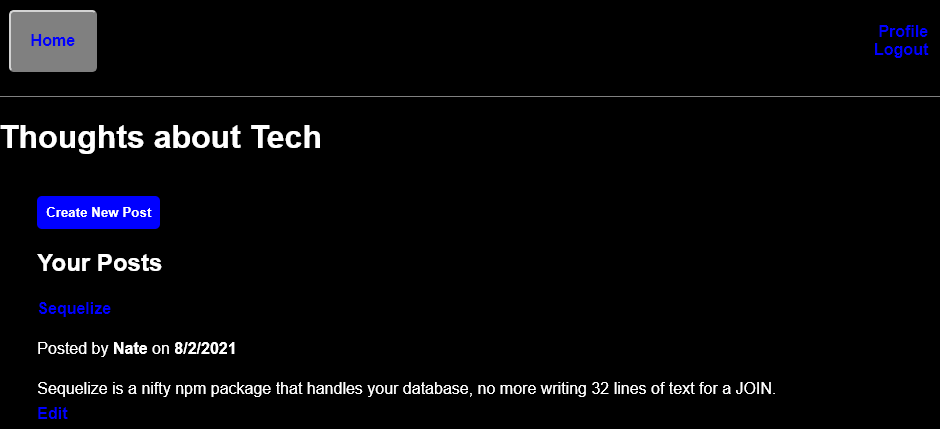

# Tech Blog

Deployed <a href="https://njt-tech-blog.herokuapp.com/">here</a>.
## Table of Contents

- [Instructions](#instructions)
- [Questions](#questions)
- [License](#license)

## Description:

The purpose of this repository is to create a tech blog site using Handlebars as a template engine to generate the html without making multiple html files, and use sequelize to create and maintain a database consisting of users, posts, and comments.

## Instructions

1. Follow <a href="https://njt-tech-blog.herokuapp.com/">this link</a> to navigate to the deployed website

2. Click on the login button
3. If you have an accout log in with your credentials, otherwise click the sign up link and make an account
4. Logging in will redirect you to your profile page, here you can view your posts
5. Clicking the edit button allows you to either edit or delete you post

unfortunately, due to time contraints and working on a class project, new posts are currently not properly linking to the user who made them. To see an example of being able to both edit and delete a post, use the login name `nate` with the password `password` this account has several posts that can be editted or deleted as a demonstration of those functions working.

## Quesions

If you have any questions, contact me <a href="https://github.com/TheHebi" target="_blank">here</a>, or send me an email at nturcotte8@live.com.

## License

This project uses the MIT License
